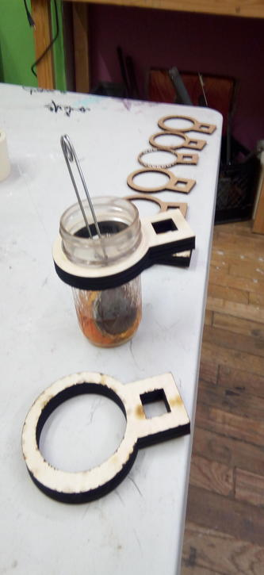

= "Cupholder" for small jar

Wooden cupholder/handle for a Mason jar. For lasering on laser cutter. Use playwood 12mm (speed 5, power 50). 

Use cup-fix.svg thus cup-fix.dxf for lasering.

== create dxf

- inkskape
- load svg
- select all
- object to path
- extra
- 
...
(see noisebridge wiki)

